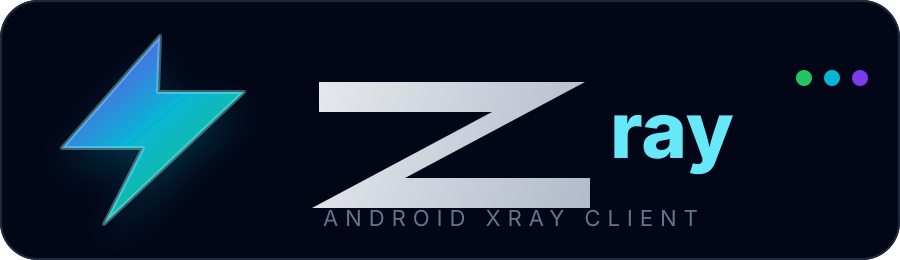

<p align="center">
  
</p>

# Z2ray

A modern Android Xray/V2Ray client for importing, managing, testing, and running proxy configurations.

[](https://github.com/trenadhunter-beep/Z2ray/actions/workflows/android_build.yml)


---

## About

**Z2ray** is an Android client built with **Kotlin**, **Jetpack Compose**, Android **VpnService**, and **Xray Core**.

> Note: V2Fly/V2Ray share links are import-compatible. The default bundled runtime is Xray (`AndroidLibXrayLite`), and CI/release workflows can also build a v2fly-flavored APK with `AndroidLibV2rayLite` using `CORE_FLAVOR=v2fly`.

It supports importing V2Ray-compatible links, managing subscriptions, measuring latency, running a real Android VPN tunnel, and displaying live traffic statistics.

---

## Features

- Real Android VPN Service
- Xray Core integration through `libv2ray.aar`
- GeoIP / GeoSite routing assets with in-app status/update support
- Reality advanced fields support
- TUN-based full-device routing
- Real traffic speed from Xray stats
- Extended parser for VLESS, VMess, Trojan, Shadowsocks, Hysteria2, SOCKS, SIP008 JSON, raw Xray JSON, and basic Clash/Mihomo YAML
- Extended transport generation for WS, gRPC, HTTP/2, HTTPUpgrade, XHTTP/SplitHTTP, mKCP, QUIC, and Hysteria2
- Subscription import and refresh
- Import/export configs backup
- QR scanner support
- Per-app proxy support
- Bypass Iran / Direct / Global routing modes
- Custom DOMAIN/IP/PROTOCOL/NETWORK routing rules with import/export
- URL connectivity test, download speed test, TCP latency, and TLS handshake diagnostics
- GeoIP/GeoSite status with SHA-256 verification details and fallback handling
- Signed release workflow with APK/source/core/assets checksums
- API 23+ / Android 6.0+ support
- Multi-language UI with Persian RTL support
- GitHub Actions APK build

---

## Supported Config Formats

| Protocol / Format | Input |
| --- | --- |
| VLESS | `vless://` |
| VMess | `vmess://` |
| Trojan | `trojan://` |
| Shadowsocks | `ss://` and SIP008 JSON |
| Hysteria2 | `hy2://`, `hysteria2://` |
| SOCKS/SOCKS5 | `socks://`, `socks5://` |
| Raw Xray config | JSON with `inbounds` / `outbounds` |
| Clash/Mihomo | Basic `proxies:` YAML parsing |

---

## Download APK

The APK is built automatically with GitHub Actions.

1. Open:

   <https://github.com/trenadhunter-beep/Z2ray/actions>

2. Open the latest successful build.
3. Scroll down to **Artifacts**.
4. Download:

```text
z2ray
```

5. Extract the ZIP file.
6. Install:

```text
z2ray.apk
```

---

## Build

```bash
git clone https://github.com/trenadhunter-beep/Z2ray.git
cd Z2ray
gradle assembleDebug
```

APK output:

```text
app/build/outputs/apk/debug/app-debug.apk
```

---

## Release

For signed release builds, see [RELEASE.md](RELEASE.md).

## License

[MIT License](LICENSE)
